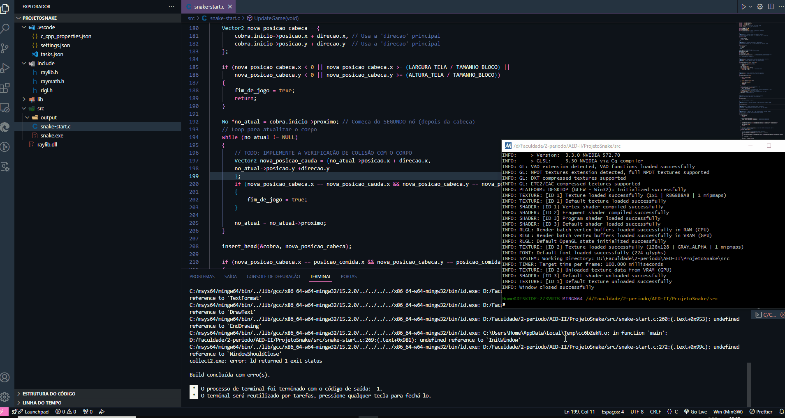

# 🐍 Jogo da Cobrinha em C — Raylib + Lista Linear

Bem-vindo ao repositório do meu projeto **Snake Game** desenvolvido em **C**, utilizando a biblioteca **Raylib** para gráficos e **listas lineares** para estruturar o corpo da cobra! Este projeto foi criado como forma de praticar lógica, estruturas de dados e organização modular de código.

---

## 🎯 Objetivo do Projeto
O objetivo principal foi implementar o clássico jogo da cobrinha de forma **didática**, utilizando estruturas dinâmicas para representar cada segmento da cobra. Além disso, busquei aprimorar meu domínio da Raylib, modularização e boas práticas.

---

## 🧠 Conceitos Utilizados

### **✔ Estruturas de Dados — Lista Linear**
A cobra é representada como uma lista dinâmica encadeada (ou uma lista linear), em que cada nó contém:
- A posição X e Y do segmento
- Um ponteiro para o próximo segmento

Essa estrutura facilita operações como:
- Movimentar o corpo da cobra
- Adicionar novos segmentos após comer a fruta
- Remover o último segmento

### **✔ Programação Modular em C**
O código foi dividido em múltiplos arquivos, como:
- `snake.c` / `snake.h` — gerenciamento da cobra
- `game.c`  — lógica principal do jogo
- `main.c` — inicialização e loop principal

### **✔ Raylib**
Utilizada para:
- Renderização dos elementos (cobra, fruta, grid)
- Controle de FPS
- Detecção de teclas
- Loop de jogo

---

## 🎮 Funcionalidades
- Controle suave da cobra com as teclas direcionais
- Sistema de aumento de tamanho baseado em lista linear
- Detecção de colisões com parede e com o próprio corpo
- Frutas geradas aleatoriamente
- Pontuação
- Tela de Game Over

---

## 📁 Estrutura do Projeto
```
📦 snake-game
├── include/
│   ├── snake.h
│   ├── game.h
├── src/
│   ├── main.c
│   ├── snake.c
│   ├── game.c
├── assets/
│   └── (imagens ou fontes opcionais)
├── Makefile
└── README.md
```

---

## 🛠 Como Executar o Projeto
### **1. Instale o Raylib**
No Linux:
```
sudo apt install libraylib-dev
```
No Windows, utilize o instalador oficial da Raylib.

### **2. Compile o Projeto**
Com Makefile:
```
make
```
Ou manualmente:
```
gcc src/*.c -o snake -lraylib -lm
```

### **3. Execute**
```
./snake
```

---

## 📸 Gameplay




---

## 🤓 O que Aprendi
- Manipulação de listas lineares
- Organização modular em C
- Uso prático da Raylib
- Lógica de animação baseada em grid
- Controle de FPS e game loop

---

## 🚀 Próximas Melhorias
- Modo turbo
- Skins diferentes para a cobra
- Sistema de níveis
- Sons e trilha sonora
- Ranking local com arquivo externo

---

## 📝 Licença
MIT License — sinta-se livre para usar, modificar e aprender com este código!

---

## 📬 Contato
Se quiser trocar ideia sobre C, Raylib, estrutura de dados ou projetos acadêmicos:

**Gabriel Souza**
- LinkedIn: www.linkedin.com/in/gabriel-oliveira-de-souza-3743352bb

---

Obrigado por conferir meu projeto! 😄

